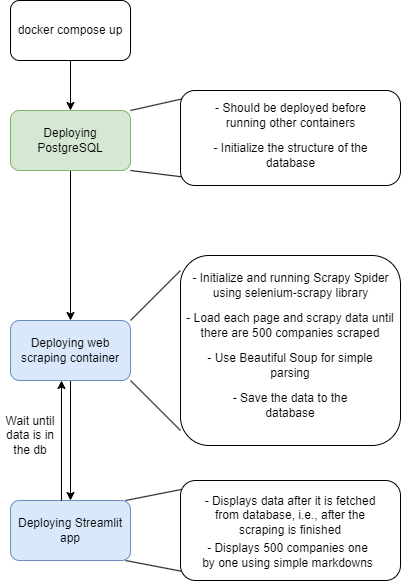

# Sreality Web Scraping Project
## Running the project
To run the project you should have Docker installed. Running is executed by command
```docker compose up```

## Main parts
The project consists of three main components running in separate docker containers:
- **Web Scraping** using Scrapy tool (see _[sreality_scraping](sreality_scraping) folder_)
- **PostgreSQL database** deployed in a separate container and shared via docker network
- **Streamlit** simple web application to display the scraped data (see _[streamlit_app](streamlit_app)_)

## Project workflow
The workflow is briefly displayed on the next picture:




